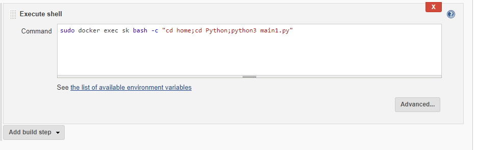

# MLOPs-task-3

The world has always seen what Machine Learning can achieve...The miracles that Data Scientists create with  their codes.

These programmers actually think and then make the models creted in ML accurate...

But what if we create a system that can run a model, retrain the model and make it accurate on its own...In short, automate the whole process a person does manually...

But is it possible with Machine Learning???

No, its not but with integration of DevOps it surely is....Thereby forming Ml+DevOps=MLOps

<h1>Just some Tasks are needed to be done...</h1>

<ul>
  <li>First task is to create a Dockerfile that will help us with creating an image with most of the required libraries installed..
    
   
   
            FROM centos

            RUN yum install python3 -y

            RUN pip3 install --upgrade pip

            RUN pip3 install keras

            RUN pip3 install tensorflow

            RUN pip3 install numpy 

            RUN pip3 install pandas

            RUN pip3 install scipy

            RUN pip3 install opencv-python

            RUN pip3 install sklearn 
            
   Now we build the image using the build command:
   
   
   
   In my case I used : 
   
   
   
   Now the image is built</li>
   
   <li>To achieve the automation..we use the Jenkins that will run a set of jobs..
      <ul>
        <li><h2>First Job</h2>
          <h4>  This Job simply just copies all files in GitHub repo to the local machine...</h4>
          
   
   1. 
   
   2. 
   
   3. 
          
          sudo cp -frv * /root/Desktop/Nischay
  </li>
  <li><h2>Second Job</h2>
          I have used Regression model as my reference model to test my whole automation system...
        I have used the Salary dataset , and this model predicts the salary for some years of experience given...
        This model is trained on the dataset of the employees having some years of experience and all of it stored in "Salary_Data.csv".
    
   I also have an extra python file that has the code to send the predicted salary value to the developer via email...
   
   
   
                  import smtplib
                  from email.message import EmailMessage

                  sender_mail="shoumiksahu2000@gmail.com"
                  rec_mail="sahushoumik23@gmail.com"
                  password="Testing2000"
                  msg = EmailMessage()
                  info='The salary predicted is '+str(salary)
                  msg.set_content(info)

                  msg['Subject'] = 'Salary Prediction'
                  msg['From'] = sender_mail
                  msg['To'] = rec_mail

                  # Send the message via our own SMTP server.
                  server = smtplib.SMTP_SSL('smtp.gmail.com', 465)
                  server.login(sender_mail,password)
                  print("Login Success")
                  server.send_message(msg)
                  print("Email has been sent to ",rec_mail)
                  server.quit()
                  
   Once the files are  copied from the GitHub 
   
   
   I appended the above code along with the code uploaded into a file called main1.py..
   
   
   
          sudo docker exec sk bash -c "cd home;cd Python; cat main.py mail.py >> main1.py 
   </li>
   <li><h2>Third Job</h2>
  This job will run as soon as the appending finishes...
  
  
  
  This Job will then check for the model and then accordingly will run a docker container for me...
  
  
  
                    if sudo cat /root/Desktop/Nischay/Python/main1.py | grep keras
                    then
                    if sudo docker ps -a | grep nn
                    then 
                    sudo docker rm -f nn
                    echo "Hello"
                    fi
                    echo "Keras Model Created"
                    sudo docker run -dit -v /root/Desktop/Nischay/Python:/home --name nn name:MLOPS
                    elif sudo cat /root/Desktop/Nischay/Python/main1.py | grep sklearn
                    then 
                    if sudo docker ps -a | grep sk
                    then 
                    sudo docker rm -f sk
                    fi
                    echo "Sklearn Model Created"
                    sudo docker run -dit -v /root/Desktop/Nischay/Python:/home --name sk name:MLOPS
                    fi
   </li>
   <li><h2>Fourth Job</h2>
        This job will be triggered after job2 is completed....
        
   
   
   Then we will run the model via that container....
   
   
   
   sudo docker exec sk bash -c "cd home;cd Python;python3 main1.py"
   
   </li>
   
   <li><h2>Fifth Job</h2>
      This job is to just monitor..if by any means the model fails...it will just restarts the model again...
    
  
  
  
  
  
  
  </li>
</ul>

If you face any problems or any doubt then feel free to contact..... 
   
   
   
   
    
 
